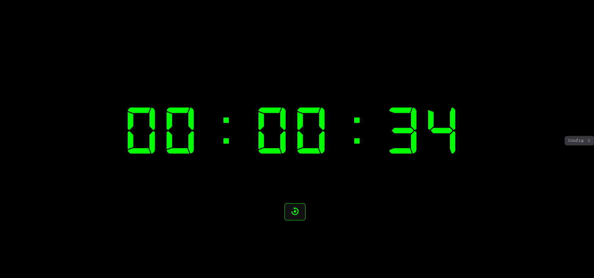

# ⏲️ Digital Timer  

Um timer digital personalizável que oferece contagem regressiva, exibição de relógio ao vivo e celebração com confetes ao término da contagem.



## Índice

- [Recursos](#recursos)
- [Instalação](#instalação)
- [Uso](#uso)
- [Configuração](#configuração)
- [Contribuidores](#contribuidores)
- [Licença](#licença)

## Recursos

- **Contagem Regressiva**: Configure um tempo específico para a contagem regressiva.
- **Relógio ao Vivo**: Exibe a hora atual em tempo real.
- **Celebração com Confetes**: Ao finalizar a contagem regressiva, uma animação de confetes é exibida.

## Instalação

1. Clone o repositório:

   ```bash
   git clone https://github.com/leonardo-ggomes/digital-timer.git
   ```


2. Navegue até o diretório do projeto:

   ```bash
   cd digital-timer
   ```


## Uso

1. Abra o arquivo `index.html` em seu navegador preferido.

2. Configure o tempo desejado para a contagem regressiva.

3. Inicie o timer e aguarde a celebração com confetes ao término.

## Configuração

- **Personalização de Estilo**:
  - Edite o arquivo `style.css` para alterar a aparência do timer conforme suas preferências.

- **Funcionalidades Adicionais**:
  - Modifique o arquivo `main.js` para adicionar ou alterar funcionalidades do timer.

## Contribuidores

- **Leonardo Gomes**: Desenvolvedor principal.

## Licença

Este projeto está licenciado sob a licença MIT. Consulte o arquivo [LICENSE](LICENSE) para mais detalhes.
